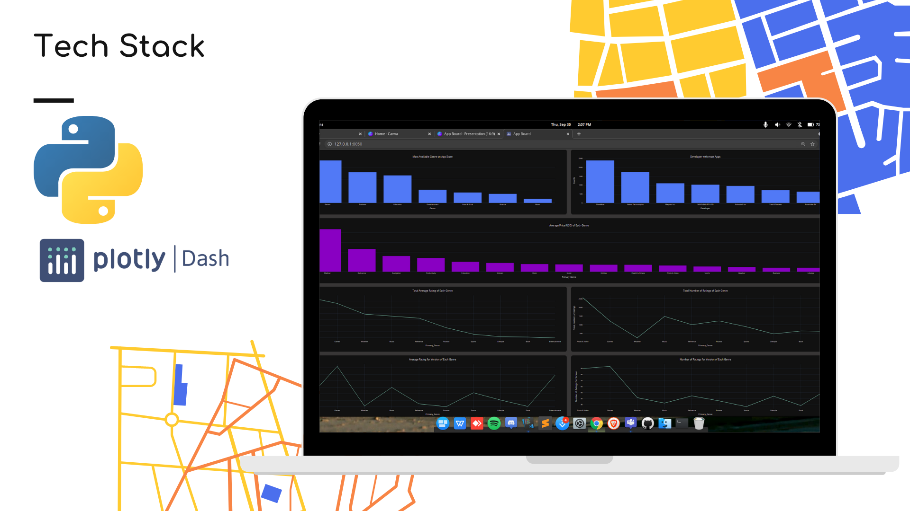

# App Board

For MLH Global Hack Week!

Analysis and visualizations can be found in the `Notebook` folder.

## Inspiration to use this Dataset

Being a developer myself, I know that the most challenging part of the development process is neither the development of the application nor the testing of it. Determining what and when to implement is the most troublesome. There are hundreds of applications available on the App Store, both Apple and Android, and not all the developers who made them are prosperous. Imagine if you knew beforehand, in what period, which app would be most thriving? What Genre of application is going to be trending the most? What price to sell your app at to maximize the profits?

Dataset [Link](https://www.kaggle.com/cmqub19/763k-ios-app-info)

## Analysis and Visualizations

1. In this repository, go to the `Notebooks` folder.
2. Data Cleaning and Pre-processing can be found in the `Data Cleaning and Pre Processing.ipnyb` file.
3. Visualizations with analysis can be found in the same folder labelled as `Data Visualization 1` & `Data Visualization 2`.

## Technical Implementation

- The dashboard follows the UI aesthetic of the bridge web application, and due to the integration of Bootstrap, it is responsive on mobile and smaller devices. Dash and plotly were used for implementation of the dashboard.
- The first step after obtaining the dataset was pre-processing, achieved using numpyand pandas packages of python. Removal of Null Values and unwanted attributes took place, and the Date-Time format was also corrected.
- After pre-processing, analysis and visualization began. Libraries like Seaborn and Matplotlib were utilized for the visualization part.

## Requirements

- Python 3.7+
- Pip Package Manager
- Jupyter Notebook & VS Code editor (not mandatory)

## Instructions

1. Clone the GitHub repo on your local machine. 
2. Navigate to the project folder in the terminal and run `pip install -r requirements.txt` to install dependencies. 
3. Open the workspace in a code editor of choice and run the `app.py` file. 
4. Navigate to `http://127.0.0.1:8050/` (or your default location) in your browser to access a local version of the dashboard.

